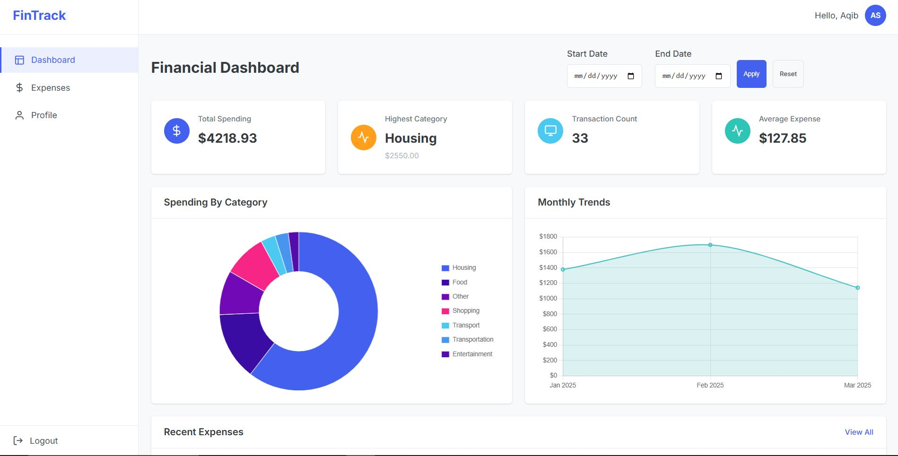

# Finance Tracker 💰

A comprehensive personal expense tracking application that helps you monitor, categorize, and analyze your spending habits.




## Overview

Finance Tracker is a web-based application designed to help users manage their personal finances by tracking expenses, categorizing spending, and providing insightful analytics. The application offers a clean, responsive interface that works seamlessly across desktop and mobile devices.

## Features

- **User Authentication** 🔐
  - Secure login and registration
  - Password reset functionality
  - User profile management

- **Expense Management** 📝
  - Add, edit, and delete expenses
  - Categorize expenses (Food, Transport, Shopping, etc.)
  - Add detailed descriptions for each expense
  - Date-based expense tracking

- **Dashboard & Analytics** 📊
  - Overview of total spending
  - Category-wise expense breakdown
  - Monthly spending trends
  - Highest and average expense statistics

- **Filtering & Sorting** 🔍
  - Filter expenses by category
  - Date range selection
  - Search functionality

- **Responsive Design** 📱
  - Optimized for desktop, tablet, and mobile devices
  - Collapsible sidebar for better mobile experience
  - Touch-friendly interface elements

## Technology Stack

### Backend
- **Django**: Python web framework for rapid development
- **SQLite/PostgreSQL**: Database for storing user and expense data
- **Django REST Framework**: For API endpoints (if applicable)

### Frontend
- **HTML/CSS/JavaScript**: Core frontend technologies
- **Responsive CSS**: Custom-built responsive design system
- **SVG Icons**: Lightweight vector icons for UI elements


## Installation
### Prerequisites
- Python 3.8 or higher
- Pip (Python package manager)
- Virtualenv (optional but recommended)

### Step 1: Clone the Repository
```bash
git clone 
cd personal-finance-tracker
```

### Step 2: Create and Activate a Virtual Environment
```bash
python -m venv env
source env/bin/activate
# On windows, use
env\scripts\activate
```

### step 3: Install Dependencies
```bash
pip install -r requirements.txt
```

### Step 4: Set up the database:
- **For SQLite (default):**
```bash
python manage.py migrate
```

- **For PostgreSQL:**
  - Update the `DATABASE` setting in `settings.py` with your PostgreSQL credentials.
  - Run migrations:


### Step 5: Create a superuser (admin):
```bash
python manage.py createsuperuser
```

### Step 6: Run the development server:
```bash
python manage.py runserver
```

### Step 7: Access the application:
- Open your browser and navigate to `http://127.0.0.1:8000/.`

___

**Happy tracking! 💸📈**